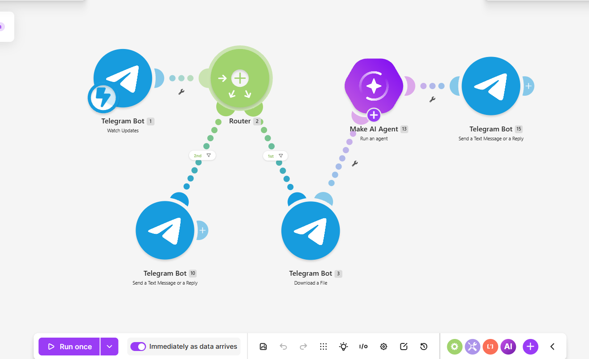
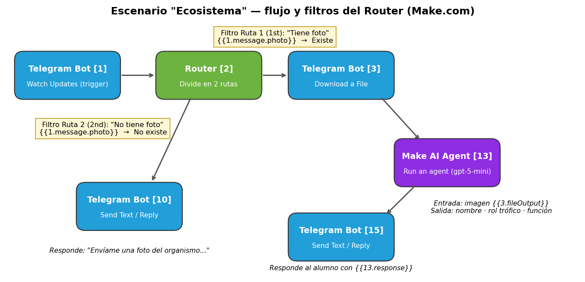
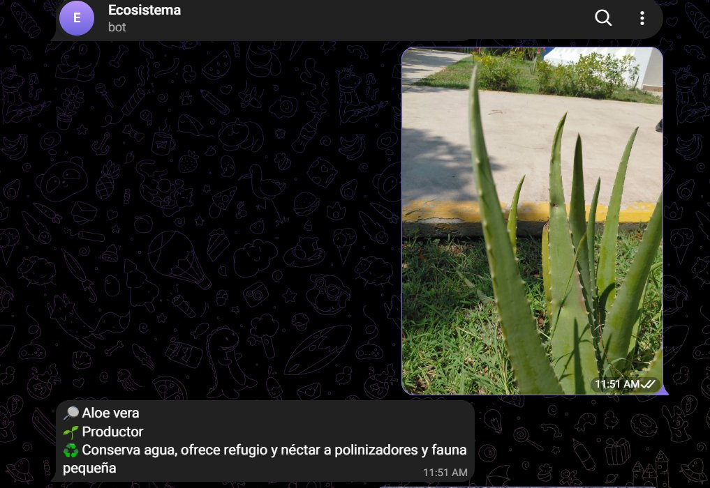
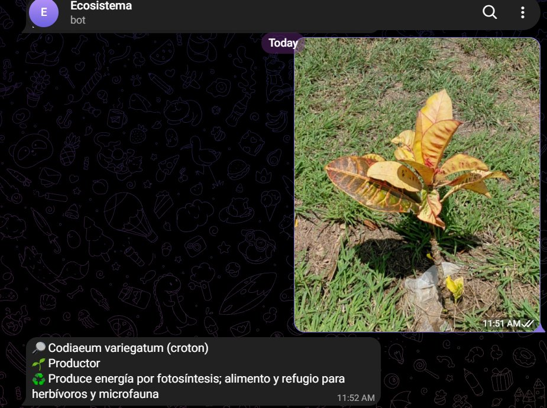

# Nombre del proyecto
Escenario "Ecosistema": identificación de organismos del jardín del Tecnológico con Telegram + IA (Make.com)

**Alumno:** Christian Paul Lizárraga Oronia
**Materia:** Desarrollo Sustentable — Instituto Tecnológico de Mazatlán
**Tema:** 2.1 El ecosistema

## Descripción
Automatización en Make.com que permite a un estudiante tomar una foto de un organismo del jardín del plantel y enviarla a un bot de Telegram. Un Agente de Inteligencia Artificial analiza la imagen y responde en segundos con:

- 🔎 el nombre probable del organismo (especie o género),
- 🌱 su rol trófico (Productor / Consumidor / Descomponedor),
- ♻️ su función dentro del ecosistema (máximo 15 palabras).

Si el alumno manda solo texto, el bot le pide una foto. Si la foto no muestra un ser vivo, le pide que lo intente con una planta, un insecto u otro organismo.

## Objetivos de aprendizaje
- Reconocer de forma práctica los componentes de un ecosistema (productores, consumidores y descomponedores) usando organismos reales del plantel.
- Configurar un disparador (trigger) de Telegram que reciba mensajes en tiempo real.
- Usar un **Router con filtros** para separar los mensajes con foto de los que no la traen.
- Enviar una imagen a un Agente de IA con visión y controlar su respuesta con un *system prompt*.
- Documentar el escenario para que se pueda reproducir y evaluar.

## Material utilizado
- Cuenta de Make.com (zona us2.make.com) con el módulo **Make AI Agent**
- Bot de Telegram creado con @BotFather (conexión `Ecosistema_bot1`)
- Proveedor de IA de Make (modelo *Large*: gpt-5-mini)
- Teléfono celular con Telegram para tomar las fotos en el jardín
- Computadora con navegador

## Diagrama del escenario

Escenario completo en Make.com:



Flujo con los filtros del Router:



| # | Módulo | Función |
|---|--------|---------|
| 1 | Telegram Bot — Watch Updates | Disparador: recibe cada mensaje enviado al bot (webhook) |
| 2 | Router | Divide el flujo en dos rutas |
| 3 | Telegram Bot — Download a File | **Ruta 1 (1st)**, filtro `{{1.message.photo}}` **Existe**: descarga la foto |
| 13 | Make AI Agent — Run an agent | Analiza la imagen con el system prompt y genera la respuesta |
| 15 | Telegram Bot — Send a Text Message or a Reply | Envía `{{13.response}}` al mismo chat |
| 10 | Telegram Bot — Send a Text Message or a Reply | **Ruta 2 (2nd)**, filtro `{{1.message.photo}}` **No existe**: pide al alumno que mande una foto |

### System prompt del Agente de IA
```
Eres un asistente educativo que identifica organismos en fotos tomadas
por estudiantes en el jardín del Tecnológico, para la materia de
Desarrollo Sustentable, tema "El Ecosistema".

Cuando recibas una imagen, responde SIEMPRE en este formato, sin texto
adicional antes o después:

🔎 [nombre común o científico más probable del organismo, lo más
específico posible: especie o género, no solo "planta" o "insecto"]
🌱 [Productor / Consumidor / Descomponedor]
♻️ [rol en el ecosistema en máximo 15 palabras]

Si dudas entre dos especies parecidas, elige la más probable según
características visibles (forma de hoja, color, tamaño, textura) y
menciónala igual sin usar términos genéricos.

Si la imagen no muestra un organismo vivo, responde únicamente:
"❌ No identifico un organismo. Intenta con una planta, insecto u otro
ser vivo."

Reglas estrictas:
- Máximo 35 palabras en total.
- Sin introducciones, sin despedidas, sin explicaciones extra.
- Responde siempre en español.
```

## Código
[blueprint.json](Codigo/blueprint.json): el blueprint del escenario exportado desde Make.com. Se puede importar con *Create a new scenario → ⋯ → Import Blueprint*.

## Video del funcionamiento
[enlace.txt](Video/enlace.txt)

[Ver video en YouTube](https://youtube.com/shorts/WUeGnCaVDFM)

## Evidencias de armado
Pruebas reales con fotos del jardín del Tecnológico:

| Aloe vera (sábila) | Croton (*Codiaeum variegatum*) |
|---|---|
|  |  |

## Reporte
Incluye: [Reporte de la práctica.pdf](Reporte/Reporte%20de%20la%20práctica.pdf)

- Descripción del escenario módulo por módulo
- Filtros del Router
- Tabla de pruebas realizadas
- Observaciones sobre el comportamiento del sistema

### Resultados de las pruebas
| Foto enviada | Respuesta del bot | Rol trófico | ¿Correcto? |
|---|---|---|---|
| Sábila del jardín | Aloe vera | Productor | ✅ |
| Planta de hojas amarillas/rojas | *Codiaeum variegatum* (croton) | Productor | ✅ |
| Mensaje solo de texto | "Envíame una foto del organismo…" | — | ✅ (ruta 2) |

## Preguntas de reflexión

**1. ¿Qué aprendí con esta práctica?**
Aprendí a usar la inteligencia artificial para identificar cosas a partir de una foto y a conectarla con Telegram en Make.com. También entendí que cada organismo del jardín tiene un papel en el ecosistema: las plantas como la sábila y el croton son productores porque hacen fotosíntesis y son la base de la cadena alimenticia.

**2. ¿Qué problemas tuve y cómo los resolví?**
Al principio la IA me respondía cosas sin sentido. Por ejemplo, en una foto donde salía una persona me dijo que era una oruga, y a la sábila la identificó solo como "planta herbácea", que es demasiado general. Lo resolví mejorando el *system prompt*: le pedí que fuera lo más específica posible (especie o género), que no usara términos genéricos, que se fijara en características visibles (forma de hoja, color, textura) y que, si la foto no muestra un ser vivo, lo dijera. También usé un modelo más potente (*Large*). Después de esos cambios identificó bien el Aloe vera y el croton.

**3. ¿Cómo se relaciona la práctica con el desarrollo sustentable?**
Conocer qué organismos hay en nuestro entorno y qué función cumplen es el primer paso para cuidarlos. El bot hace que cualquier estudiante pueda aprender sobre la biodiversidad del plantel sin ser experto, y las respuestas se pueden juntar como un inventario de las especies del jardín.

**4. ¿Qué limitaciones tiene usar IA para esto?**
La IA puede equivocarse, sobre todo con fotos borrosas, organismos muy pequeños o especies parecidas. Por eso sus respuestas deben tomarse como una "identificación probable" y verificarse. Además, cada ejecución consume operaciones (créditos) de Make.

## Conclusiones
El escenario cumple su objetivo: recibe una foto por Telegram, la envía a un Agente de IA y responde en pocos segundos con el nombre del organismo, su rol trófico y su función en el ecosistema. El Router con dos filtros evita errores cuando el alumno manda solo texto. La parte más importante fue ajustar las instrucciones del agente, porque la calidad de la respuesta depende de qué tan claro y específico es el *system prompt*.

## Resultados
[Resultados.pdf](Resultados/Resultados.pdf)

Este documento contiene lo que se aprendió en la práctica, los problemas encontrados y cómo se solucionaron.
